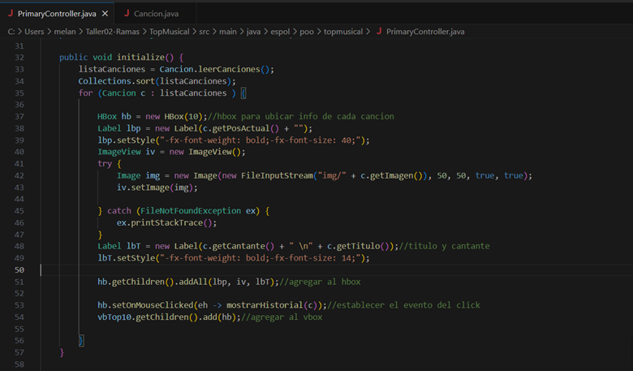
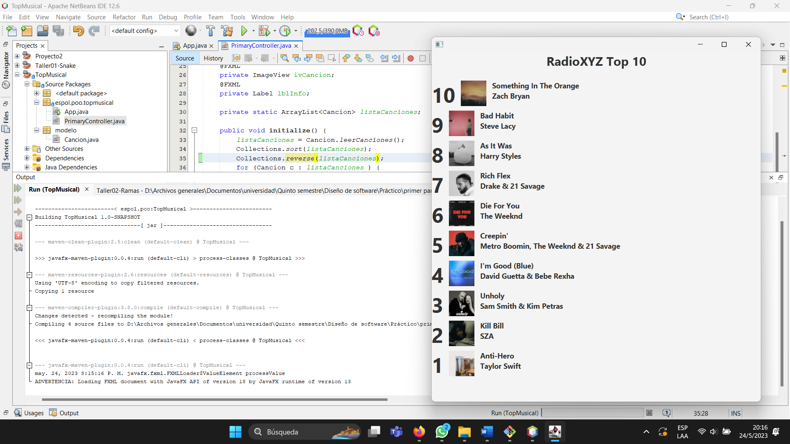

# Taller02-Ramas
TallerRamasGit

# Cambio realizado por el líder

# Cambio realizado por el integrante 4

#Cambio integrante 3

 artista

# Cambio integrante 2

#Cambio realizado por el integrante 1

